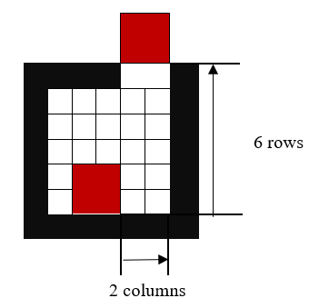
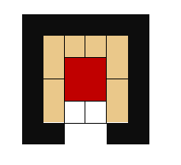
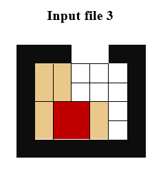
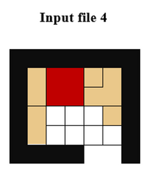
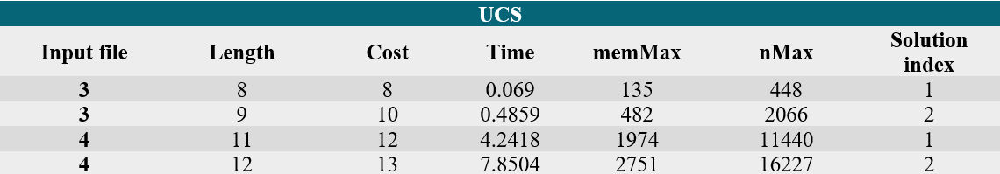
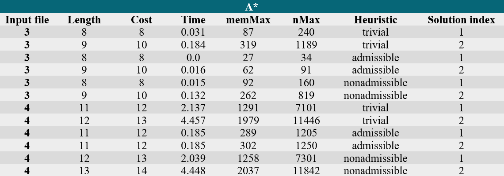
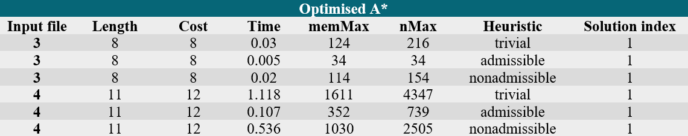
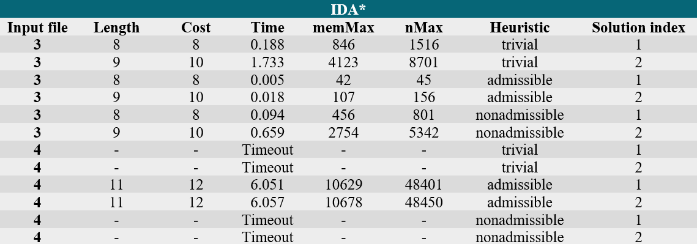

# Klotski solver

[Klotski](https://en.wikipedia.org/wiki/Klotski) is a sliding block puzzle, usually consisted of 10 blocks, placed in a framed box. The puzzle's goal is to bring a special block in a specific place or to remove it from the box, which has an exit on the border.

# Our problem

Our puzzle can have blocks of different shapes. They are not necessary rectangular. There is only one exit and the special block must be removed from the box.


## Rules

1. The blocks can be moved up, down, to the left and to the right, only if there is space to make the move.
2. Only the special block can be removed.
3. The blocks can enter the exit's space, but no other block other than the special block can be removed, not even with one fragment.


## Goal

Our goal is to find the best solution to the puzzle. We want to find the best solution either in a minimum number of steps (the shortest path from the beginning state to the end) or a minimum amount of time.

Our goal is to compare different search algorithms and observe which is the most efficient. 

## Encoding

The blocks are encoded according to the following rule:

- letters or digits - for the blocks
- '*' - for the special block
- '#' - for the border
- '.' - for the empty spaces

The box is represented by a character matrix, using the characters defined above. There cannot be more blocks with the same name (encoding).


## Input data

The input data must be written in a file, as a matrix as we defined above. 

The input data is validated, so illegal characters are not allowed.


## Output data

The output is written in a file, auto-generated by the program. In this file, the following information is generated:

- what block has been moved and the direction
- the length of the path from the start state to the end
- the cost of the found path
- the time needed for the algorithm to complete the search
- the maximum number of nodes existing in the memory space at a time
- the total number of generated nodes

To solve the problem, we tried the following algorithms: UCS (Uniform Cost Search), A*, optimised A* and IDA* (Iterative Deepening A*).

The algorithms are being run with a timeout, to stop the search in case it takes too much time.

## Heuristics

The A* based algorithms need a heuristic to run. The implemented heuristics are explained further:

1. ***Trivial heuristic:*** the idea is that the special block must be moved at least once **if** it is still in the box, or, if it has been removed, it mustn't be moved at all. So, this heuristic can only have two values: 1 or 0. 

2. ***Admissible heuristic:*** the heuristic is based on the Manhattan distance. This distance is calculated by adding the number of rows and the number of columns that the special block must be moved to be removed. For example:

<p align="center">
  
</p>

In this case, the Manhattan distance is 8.

**Note:** we calculate the Manhattan distance as the box would contain only the special block (ignoring any other block).

3. ***Nonadmissible heuristic:*** we can think that a valid heuristic is the calculation of the number of blocks around the special block. But this heuristic isn't admissible, which we can see in the following example:

<p align="center">
  
</p>

In this case, the number of blocks around is 6, but the minimum number of moves to remove the special block is 4.


# Algorithm comparison

As mentioned above, the implemented algorithms are UCS, A*, optimised A* and IDA*. The algorithms have been run with a timeout of 10 seconds and a required number of solutions of 2.

The interesting input files are the third and the fourth, having the following initial table configurations:

<p align="center" display="inline-block">
  
  
</p>
 
The values obtained are put in the following table:
(**Note:** memMax is the maximum number of nodes in the memory at one time, nNax is the total number of generated nodes)

<p align="center">
  
  
  
  
</p>


# Running the program

The synthax of the command that runs the program is:

```bash
$ python main.py -if $input_folder -of $output_folder -t $timeout -nsol $no_of_solutions
```

The data used to compare the algorithms were collected using the command:

```bash
$ python main.py -if input_folder -of output_folder -t 10 -nsol 2
```

Another ways to run the program:

```bash
$ python main.py --input_folder input_folder --output_folder output_folder --timeout 15 -nsol 5
```
```bash
$ python main.py -if input_folder -of output_folder -nsol 5 --timeout 15 
```

If the ```python``` command is not found, then try replacing it with ```python3```.
